# 2026 Push Back

SSIS Robotics in the "Push Back" VEX competition 2025-2026

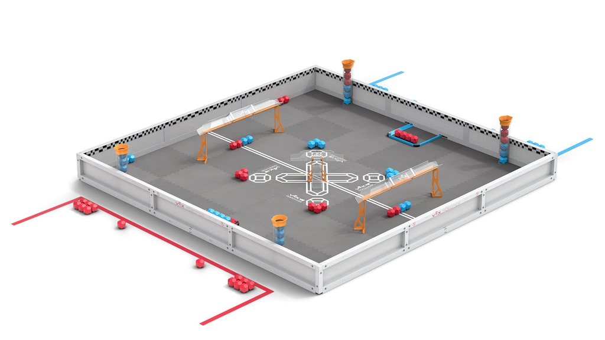

## Scrimmage 2025/10/11

This year 23 teams visited SSIS to [kick of the new season](https://www.robotevents.com/robot-competitions/vex-robotics-competition/RE-V5RC-25-0562.html#general-info) and learn from one another. Once more unbeatable: LSTS MAKO MANIACS with 7 wins and 0 losses or ties. Best SSIS team: 1599X SSIS Hawks.

 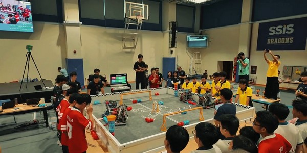 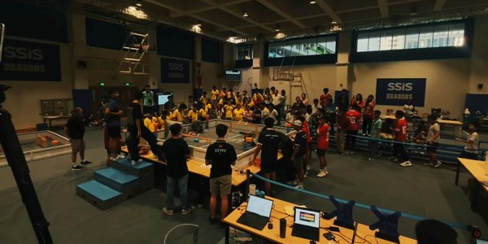 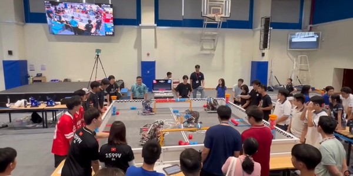

## Vietnam Road to National: Southern Qualification Season 25-26 - 2025/11/22-23

Time for southern teams to qualify for the National Championship in February 2026. While looking forward to this first Signature event, it is a tough competition between the 37 teams on the [Vietnam Road to National: Southern Qualification Season 25-26](https://www.robotevents.com/robot-competitions/vex-robotics-competition/RE-V5RC-25-1400.html#agenda).

Qualified for the National Chamionship are:

- 23457S	BRICK Lab SUPER	5-0-0	11 / 50 / 128
- 62024N	Panda Robotics	4-1-0	11 / 40 / 143
- 50922T	LSTS MAKO MANIACS	4-2-0	11 / 40 / 102
- 28176N	Overwatch	5-1-0	10 / 35 / 186
- 1599N	SSIS Big Pink Pegasus

It was an [eventful](https://www.youtube.com/live/fuf7YvmOIrU) weekend. The teamwork is on full display, the robots are getting more sophisticated and the notebooks improve their quality, too. Team [20226H](https://www.robotevents.com/teams/V5RC/20226H) (NGS Hogrider) from the [Hanoi–Amsterdam High School for the Gifted](https://en.wikipedia.org/wiki/Hanoi%E2%80%93Amsterdam_High_School) really improved their gameplay and design in just a few weeks. Their robot design has 6 motors for 4 omniwheels and 2 traction wheels 3.25" diameter to be more agile. Per calculation of the gears this should result in 360 rpm on the wheels. It resulted in the **INNOVATE Award** for this team!

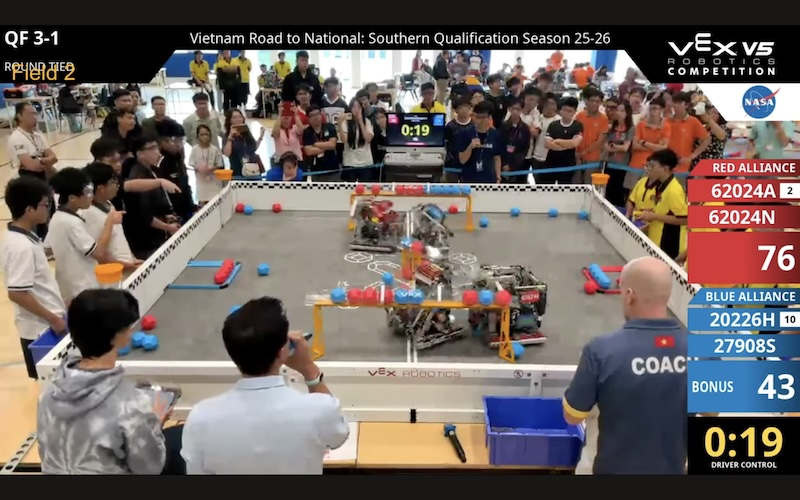 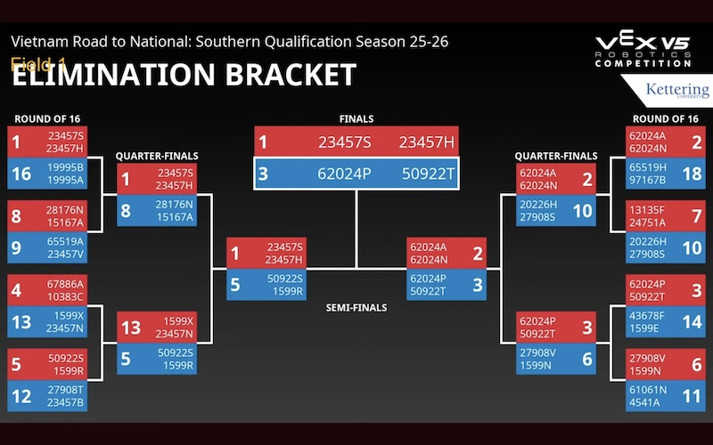 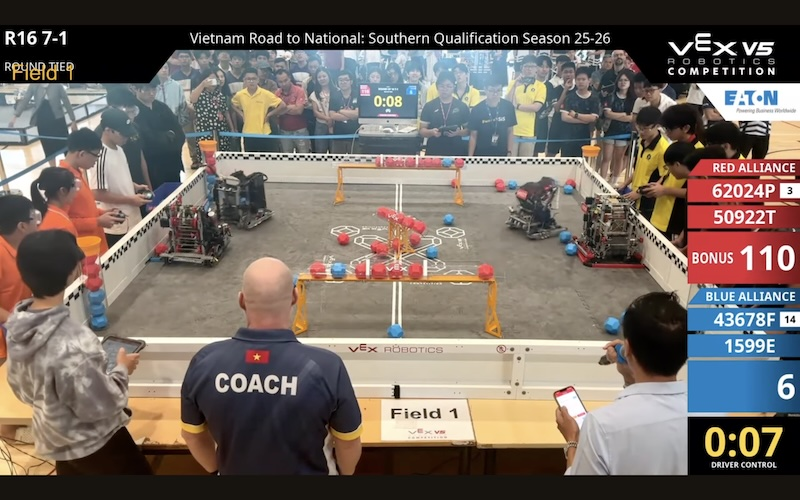

Almost unbeatable again: [50922T LSTS MAKO MANIACS](https://www.robotevents.com/teams/V5RC/50922T) with the **Excellence Award**, **Tournament Champion** and **Skills Champion**. Congratulations! Their robot is also driven by six 11W motors, but has only 4 omniwheels 3.25 inch. Their secret? **460 rpm** on the wheels, they are really fast! Being pushed from the side is not a question, they are out of their way too fast. Another omniwheel in the center is used for odometry.

 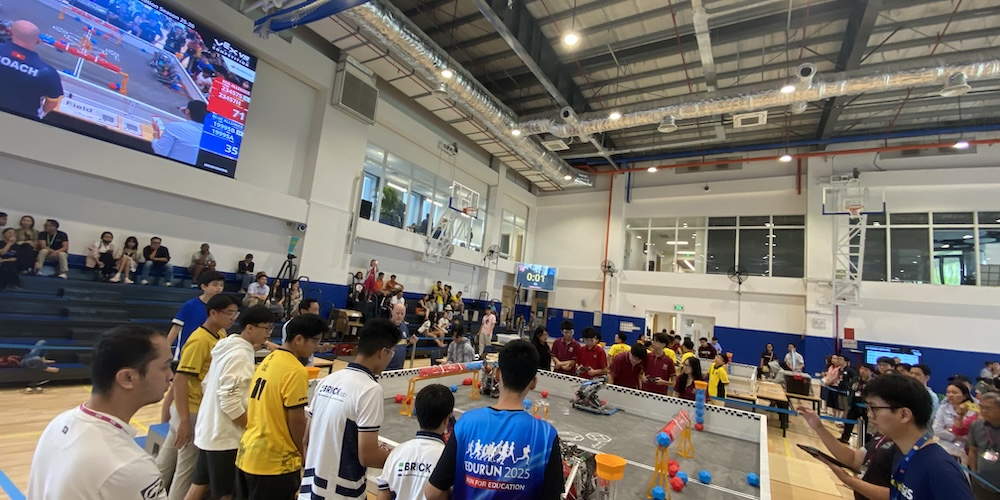 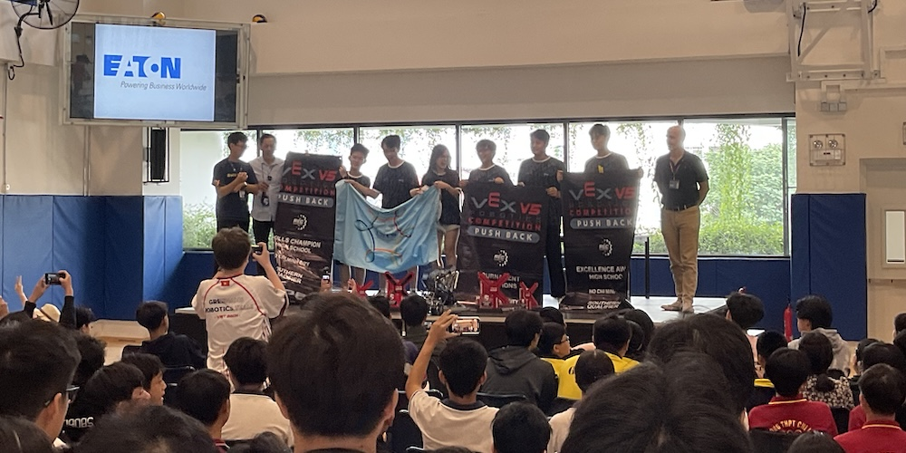

As I learned there are more ways to qualify for VEX Worlds. For example there are the [Online Challenges](https://challenges.robotevents.com/). It was highlighted at VEX Nationals last season, and team 36070M won a spot at VEX World 2025 as [Team 11](https://challenges.robotevents.com/user/144229) in 2025 Challenges > [STEM Advocacy Challenge - High School](https://challenges.robotevents.com/challenge/287/stem-advocacy-challenge/entry) > [Empowering Cao Bang through Robotics](https://challenges.robotevents.com/challenge/287/stem-advocacy-challenge/entry/14761) with a [PDF file](https://challenges.robotevents.com/uploads/0025238_original.pdf) (39 pages) or a [website](https://sites.google.com/view/team-11-36070m/home). And then there are other challenges like [IECF](https://en.wikipedia.org/wiki/International_Science_and_Engineering_Fair) challenge that teams from Vietnam can participate in.

## V5RC HS Vietnam National Championship: Push Back - 2026/01/10 - 11

This event is hosted by VREC, here is [the link on RobotEvents.com](https://www.robotevents.com/robot-competitions/vex-robotics-competition/RE-V5RC-25-3807.html) and held in Hanoi at [Alphaschool](https://alphaschool.edu.vn/en/) SmartCity [Hệ thống Giáo dục Alpha, Lô A26 KĐT Geleximco](https://maps.app.goo.gl/ZQzNAPwcfTtCpw777), Lê Trọng Tấn, Nam An Khánh, Hoài Đức. **23 Teams** from Vietnam went there. Great result for SSIS, team 1599N Pink Pegasus (with website: [pinkpegasus.org](https://pinkpegasus.org/) and [Instagram](https://www.instagram.com/reel/DTf49GCDgBA/?utm_source=ig_web_copy_link&igsh=NTc4MTIwNjQ2YQ==)) won the Excellence Awart (with a proud [coach](https://www.facebook.com/frankhua.media/posts/pfbid0a1psYyTKeBcwx5TGnXLyZtRjymW7Rec9KALEkMFMGQ7ac19E7eKbaBCKAyBiooKRl)) and qualifies for VEX Worlds in St. Louis in April 2026. Other winners:

- Exellence Award: **1599N**	SSIS Big Pink Pegasus
- Tournament Champions: **86669A**	EDS_Bunreal (Hung Yen)
- Tournament Champions: **62595A**	EDS _ Phomidable
- Design Award:	**50922T**	LSTS MAKO MANIACS	

## Vietnam Signature: New Year’s Mayhem - High School V5RC: Push Back 2026/02/06 - 8

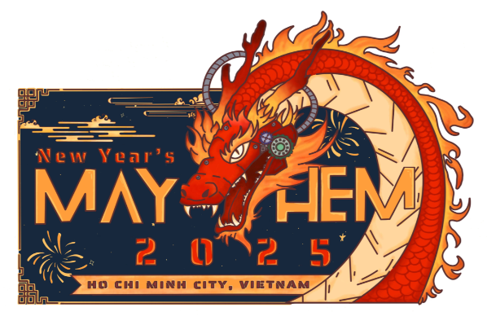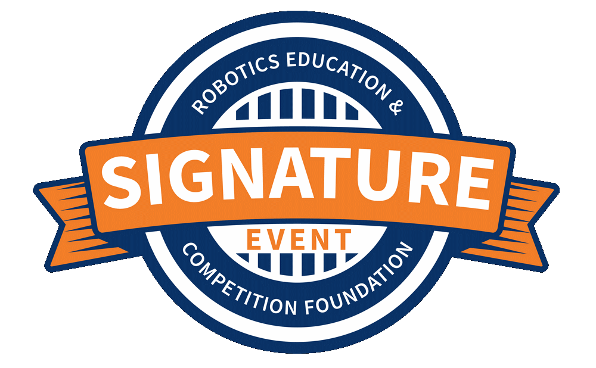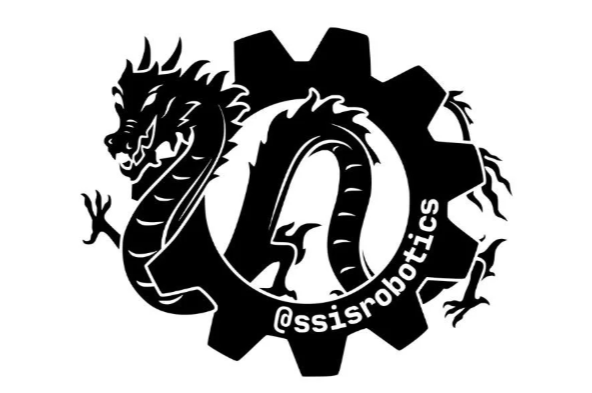

The [first signature event in Vietnam](https://www.robotevents.com/robot-competitions/vex-robotics-competition/RE-V5RC-25-0160.html#general-info)! Happening in February 2026, open for 70 HS teams across Asia! And 50% is given to teams outside of Vietnam. By November 2025 we have already [signups from 7 countries](https://www.robotevents.com/robot-competitions/vex-robotics-competition/RE-V5RC-25-0160.html#teams), including China, Taiwan, Macau, Indonesia, Thailand, Singapore and Kazakhstan!

## Virtual Skills Standings

On November 22nd, 2025, there are 329 entries from different teams. 8 team from Vietnam are in there, and again it is LSTS MAKO MANIACS who's taking the lead:

| Rank | Score | Stop Time | Team Number | Team Name             | Organization                             |
|------|-------|-----------|-------------|-----------------------|------------------------------------------|
| 9    | 90    | 0         | 50922T      | LSTS MAKO MANIACS     | Lawrence S.Ting School                   |
| 10   | 90    | 0         | 50922S      | LSTS VERTEX           | Lawrence S.Ting School                   |
| 66   | 53    | 0         | 1599N       | SSIS Big Pink Pegasus | Saigon South International School (SSIS) |
| 78   | 50    | 2         | 23457H      | BL SAI GON CHEETAH    | BRICK lab Robotics                       |
| 182  | 24    | 24        | 23457S      | BRICK Lab SUPER       | BRICK lab Robotics                       |
| 197  | 23    | 0         | 23457B      | BRICK Lab Robotics    | BRICK Lab Robotics Club                  |
| 284  | 4     | 18        | 19882U      | UNIS Hanoi V5         | UNIS Hanoi                               |
| 297  | 2     | 48        | 88527F      | VenomWizor            | Trường THPT FPT Tây Hà Nội               |

## Available spots at Worlds

The year 2025 saw another increase in interest for VEX V5 in Vietnam. How is 2026? We'll see. There were [7 spots at V5RC](https://kb.roboticseducation.org/hc/en-us/articles/5474199602071-Qualifying-Criteria-for-VEX-Robotics-Competition-Events) for Vietnam in 2025, so 2026:

|       Season        | VIQRC (ES) | VIQRC (MS) | V5RC (MS) | V5RC (HS) | SSIS |
|---------------------|:----------:|:----------:|:---------:|:---------:|:----:|
| 2018  In The Zone   |      -     |      -     |     -     |     1     |   1 - [76209G](https://www.robotevents.com/teams/V5RC/76209G) |
| 2019 Turning Point  |      -     |      -     |     -     |     1     |   1 - [76209X](https://www.robotevents.com/teams/V5RC/76209X) |
| 2020 Tower Takeover |      -     |      -     |     -     |  Covid19  |   1 - [76209G](https://www.robotevents.com/teams/V5RC/76209G) |
| 2021 Change-Up      |   Covid19  |   Covid19  |  Covid19  |  Covid19  |   -  |
| 2022 Tipping Point  |   Covid19  |   Covid19  |  Covid19  |  Covid19  |   -  |
| 2023 Spin Up        |      [6](https://en.vietnamplus.vn/vietnam-to-send-20-teams-to-vex-robotics-world-championship-2023-post247574.vnp)     |     [13](https://baogialai.com.vn/hoc-sinh-gia-lai-tiec-nuoi-dung-buoc-o-vong-loai-giai-vo-dich-the-gioi-vex-robotics-2023-post236206.html)     |     1     |     1     |   [2](https://sites.google.com/ssis.edu.vn/vex) - [76209M](https://www.robotevents.com/teams/V5RC/76209M) & [76209R](https://www.robotevents.com/teams/V5RC/76209R) |
| 2024 Over Under     |      3     |      5     |     1     |     3     |   0  |
| 2025 High Stakes    |      3     |      5     |     3     |   4 + 2   |   1 - [1599V](https://www.robotevents.com/teams/V5RC/1599V) |
| 2026 Push Back      |      3     |      3     |     1     |     3     |   ?  |

Will the Vietnam Banana Farmers is return to Dallas once again?
