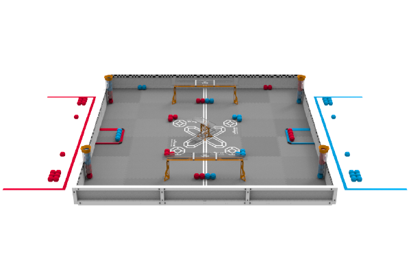

# 2026 Push Back

SSIS Robotics in the "Push Back" VEX competition 2025-2026

## SSIS VEX Robotics Scrimmage 2025/10/05

TBD.

## Available spots at Worlds

The year 2025 saw another increase in interest for VEX V5 in Vietnam. How is 2026? We'll see. There were [7 spots at V5RC](https://kb.roboticseducation.org/hc/en-us/articles/5474199602071-Qualifying-Criteria-for-VEX-Robotics-Competition-Events) for Vietnam in 2025, so 2026:

|      | VIQRC (ES) | VIQRC (MS) | V5RC (MS) | V5RC (HS) | SSIS |
|------|:----------:|:----------:|:---------:|:---------:|:----:|
| 2018 |      -     |      -     |     -     |     1     |   1  |
| 2019 |      -     |      -     |     -     |     1     |   1  |
| 2020 |      -     |      -     |     -     |  Covid19  |   1  |
| 2021 |   Covid19  |   Covid19  |  Covid19  |  Covid19  |   -  |
| 2022 |   Covid19  |   Covid19  |  Covid19  |  Covid19  |   -  |
| 2023 |      [6](https://en.vietnamplus.vn/vietnam-to-send-20-teams-to-vex-robotics-world-championship-2023-post247574.vnp)     |     [13](https://baogialai.com.vn/hoc-sinh-gia-lai-tiec-nuoi-dung-buoc-o-vong-loai-giai-vo-dich-the-gioi-vex-robotics-2023-post236206.html)     |     1     |     1     |   [2](https://sites.google.com/ssis.edu.vn/vex)  |
| 2024 |      3     |      5     |     1     |     3     |   0  |
| 2025 |      3     |      5     |     3     |     4     |   [1](https://www.robotevents.com/teams/V5RC/1599V)  |
| 2026 |      ?     |      ?     |     ?     |     ?     |   ?  |

Will the Vietnam Banana Farmers (previous Vector as 76209R Racoons [Rookies] team) is return to Dallas again?
